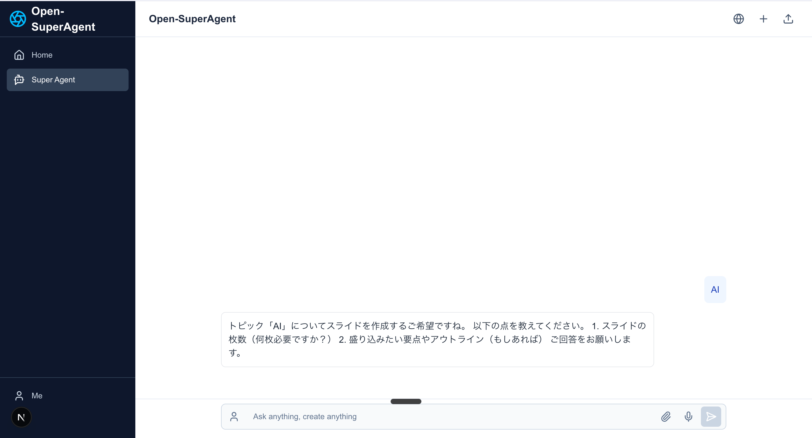

# AI Agent Presentation

スライド作成機能を備えたAIチャットアプリケーション。Mastraエージェントと連携して、会話からプレゼンテーションスライドを自動生成します。



## 主な機能

- **AIチャット**: シンプルで使いやすいチャットインターフェース
- **スライド自動生成**: 会話内容からプレゼンテーションスライドを自動生成
- **ツール実行の可視化**: Mastraエージェントのツール実行状況をリアルタイムに表示
- **レスポンシブデザイン**: モバイルからデスクトップまで対応したUI

## 技術スタック

- **フロントエンド**: Next.js 15、TailwindCSS、Vercel AI SDK
- **バックエンド**: Mastraエージェントフレームワーク
- **デプロイ**: Vercel

## セットアップ手順

### 前提条件

- Node.js v20以上
- Mastraのローカル環境

### インストール

```bash
# リポジトリをクローン
git clone https://github.com/yourusername/ai-agent-presentation.git
cd ai-agent-presentation

# 依存パッケージをインストール
npm install

# 開発サーバーを起動
npm run dev
```

### Mastraサーバーのセットアップ

1. Mastraサーバーを別のターミナルで起動:

```bash
cd ai-agent-presentation
mastra dev
```

2. Mastraエージェントのビルド:

```bash
mastra build
```

3. ブラウザで http://localhost:3000 にアクセス

## 使い方

1. チャットインターフェースでテーマやスライドの内容について質問や指示を入力
2. AIがスライド作成のプランを提案
3. プランに同意すると、AIがスライド作成ツールを実行
4. 生成されたHTMLスライドをプレビュー

## ライセンス

このプロジェクトは MIT ライセンスの下で公開されていますが、**商用利用に関しては以下の制限があります**:

- 商用利用は以下のコミュニティ参加者のみに許可されています:
  - [AI Freak Summit](https://x.com/Notion_freak/status/1919240291170828444) の参加者
  - [AIで遊ぼうコミュニティ](https://www.ai-porseo.com/play-with-ai) のメンバー

上記コミュニティに所属していない場合、個人利用・学習目的での利用のみ許可されています。

## 貢献について

バグレポートや機能リクエストは GitHub Issues で受け付けています。プルリクエストも大歓迎です！

## 連絡先

質問や問い合わせは GitHub Issues または以下のSNSでお願いします:

- Twitter: [@yourtwitterhandle](https://twitter.com/yourtwitterhandle)

---

This is a [Next.js](https://nextjs.org) project bootstrapped with [`create-next-app`](https://nextjs.org/docs/app/api-reference/cli/create-next-app).

## Getting Started

First, run the development server:

```bash
npm run dev
# or
yarn dev
# or
pnpm dev
# or
bun dev
```

Open [http://localhost:3000](http://localhost:3000) with your browser to see the result.

You can start editing the page by modifying `app/page.tsx`. The page auto-updates as you edit the file.

This project uses [`next/font`](https://nextjs.org/docs/app/building-your-application/optimizing/fonts) to automatically optimize and load [Geist](https://vercel.com/font), a new font family for Vercel.

## Learn More

To learn more about Next.js, take a look at the following resources:

- [Next.js Documentation](https://nextjs.org/docs) - learn about Next.js features and API.
- [Learn Next.js](https://nextjs.org/learn) - an interactive Next.js tutorial.

You can check out [the Next.js GitHub repository](https://github.com/vercel/next.js) - your feedback and contributions are welcome!

## Deploy on Vercel

The easiest way to deploy your Next.js app is to use the [Vercel Platform](https://vercel.com/new?utm_medium=default-template&filter=next.js&utm_source=create-next-app&utm_campaign=create-next-app-readme) from the creators of Next.js.

Check out our [Next.js deployment documentation](https://nextjs.org/docs/app/building-your-application/deploying) for more details.
